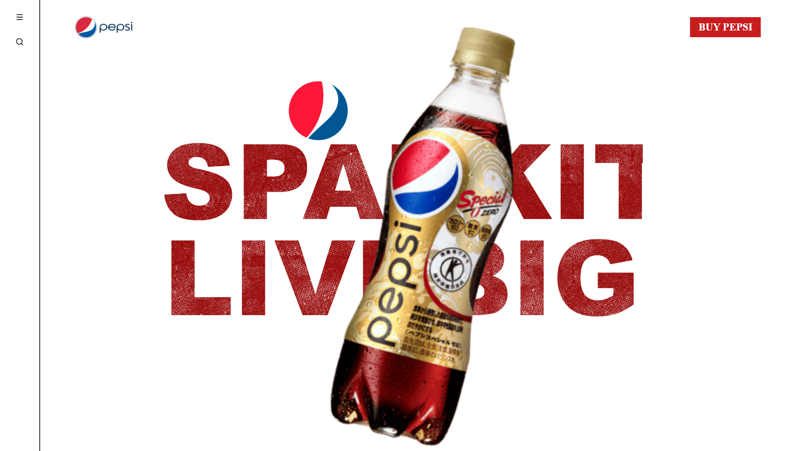
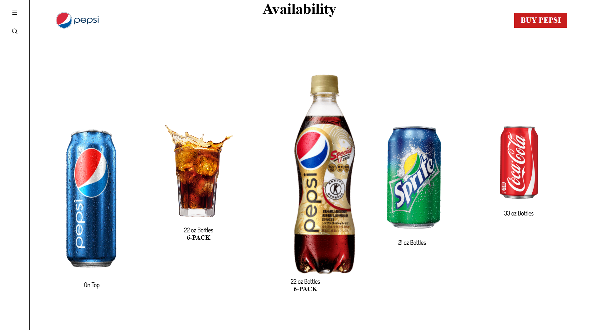

# Pepsi Landing Page 🥤

A modern, responsive landing page for Pepsi built with HTML, CSS, and JavaScript. Experience the perfect blend of design and functionality.

## 🚀 Features

| Feature | Description |
|---------|-------------|
| Responsive Design | Seamlessly adapts to all devices and screen sizes |
| Modern UI | Sleek and contemporary interface design |
| Animations | Smooth transitions and interactive elements |
| Performance | Optimized for fast loading and smooth experience |
| Accessibility | Built with accessibility best practices |

## 📸 Preview




## 🛠️ Tech Stack

| Technology | Purpose |
|------------|---------|
| HTML5 | Structure and content |
| CSS3 | Styling and animations |
| JavaScript | Interactivity and functionality |
| Flexbox/Grid | Modern layout techniques |
| Responsive Design | Cross-device compatibility |

## 📦 Getting Started

### Prerequisites

- Modern web browser
- Code editor (VS Code recommended)

### Installation

1. Clone the repository:
```bash
git clone https://github.com/yourusername/pepsi-landing-page.git
```

2. Navigate to the project directory:
```bash
cd pepsi-landing-page
```

3. Open `index.html` in your browser or use a local server.

## 🎨 Design Features

| Feature | Description |
|---------|-------------|
| Color Scheme | Pepsi brand colors and modern palette |
| Typography | Clean and readable fonts |
| Layout | Grid-based responsive design |
| Animations | Smooth transitions and hover effects |
| Components | Reusable UI elements |

## 🤝 Contributing

We welcome contributions! Please follow these steps:

1. Fork the repository
2. Create your feature branch (`git checkout -b feature/AmazingFeature`)
3. Commit your changes (`git commit -m 'Add some AmazingFeature'`)
4. Push to the branch (`git push origin feature/AmazingFeature`)
5. Open a Pull Request